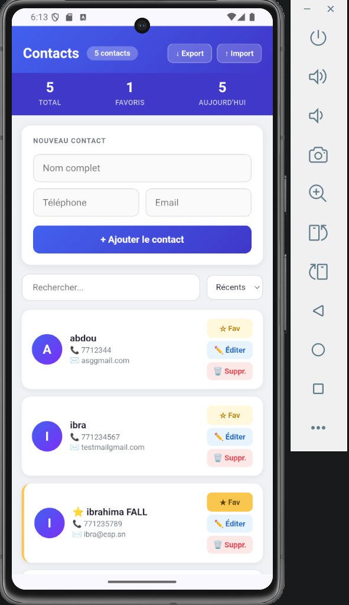
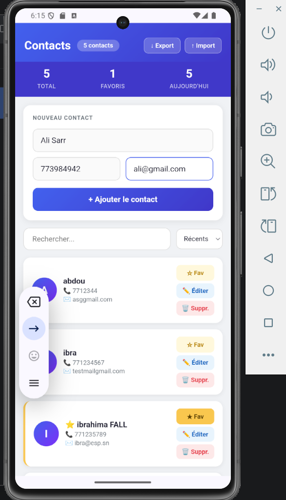
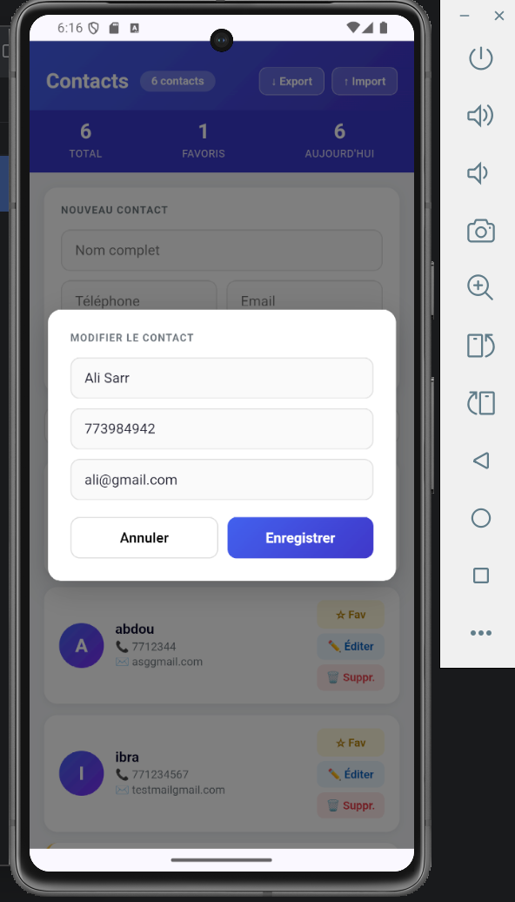

# 📱 Contact Manager

> Application mobile hybride de gestion des contacts développée avec Apache Cordova dans le cadre du module de Programmation Mobile.

---

## 📸 Aperçu

<p align="center">
  
  
  
</p>

---

## 🎯 Objectif

Développer une application mobile fonctionnelle permettant de gérer des contacts directement sur Android, avec une interface moderne et un fonctionnement complet en mode hors ligne.

---

## ✅ Fonctionnalités

| Fonctionnalité | Description |
|---|---|
| ➕ Ajouter | Ajout d'un contact avec nom, téléphone et email |
| ✏️ Modifier | Modification via fenêtre modale pré-remplie |
| 🗑️ Supprimer | Suppression avec confirmation |
| 🔍 Rechercher | Filtrage instantané par nom, téléphone ou email |
| ⭐ Favoris | Mise en favori avec indicateur visuel |
| 🔃 Trier | Tri par date, alphabétique ou favoris |
| 📊 Statistiques | Total, favoris et contacts ajoutés aujourd'hui |
| 📤 Export JSON | Sauvegarde des contacts dans un fichier JSON horodaté |
| 📥 Import JSON | Restauration sans doublons depuis un fichier JSON |
| 💾 Offline | Données persistantes via localStorage |

---

## 🛠️ Technologies utilisées

- **Apache Cordova 13** — framework mobile hybride
- **HTML5** — structure de l'interface
- **CSS3** — design responsive et moderne
- **JavaScript ES5+** — logique applicative
- **localStorage** — persistance locale des données
- **cordova-plugin-file** — accès au système de fichiers Android
- **Android SDK API 36** — plateforme cible

---

## 📁 Structure du projet

```
ContactManager/
├── www/
│   ├── index.html        → Interface principale
│   ├── css/
│   │   └── style.css     → Design et mise en page
│   └── js/
│       └── app.js        → Logique CRUD, export/import, tri
├── config.xml            → Configuration Cordova
├── package.json          → Dépendances npm
└── .gitignore
```

---

## ⚙️ Installation et lancement

### Prérequis

- Node.js v18+
- Java JDK 17
- Android Studio + Android SDK
- Apache Cordova

### Étapes

```bash
# 1. Installer Cordova globalement
npm install -g cordova

# 2. Installer les dépendances
npm install

# 3. Ajouter la plateforme Android
cordova platform add android

# 4. Ajouter le plugin fichier
cordova plugin add cordova-plugin-file

# 5. Build
cordova build android

# 6. Lancer sur émulateur
cordova emulate android
```

---

## 📤 Synchronisation — Export / Import JSON

L'application permet d'exporter tous les contacts dans un fichier `.json` horodaté
(`contacts_2026-05-22.json`) sauvegardé dans le dossier **Téléchargements** de l'appareil Android.

Ce fichier peut ensuite être réimporté sur n'importe quel appareil.
L'import fusionne intelligemment les données **sans créer de doublons**
(vérification croisée par numéro de téléphone et adresse email).

---

## 👤 Auteur

**Ibrahima FALL**  
Master 2 Systèmes Réseaux et Télécommunications  
École Supérieure Polytechnique de Dakar — ESP/UCAD

---

## 👥 Groupe

| Étudiant | Projet |
|---|---|
| Ibrahima FALL | Contact Manager |
| DELL | IMC Calculator |
| DIENG | To Do List |

---

## 📚 Contexte académique

Projet réalisé dans le cadre du module **Développement d'applications mobiles** — Développement d'applications mobiles hybrides avec Apache Cordova.