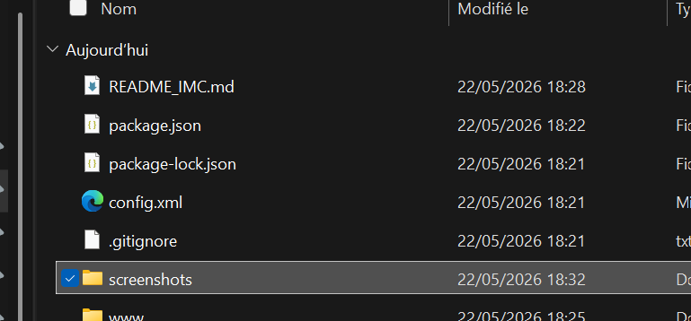
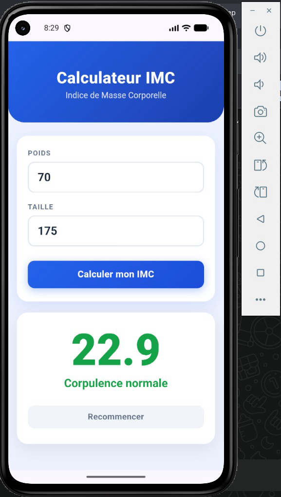

# 🏋️ IMC Calculator

> Application mobile hybride de calcul de l'Indice de Masse Corporelle développée avec Apache Cordova dans le cadre du module de Programmation Mobile.

---

## 📸 Aperçu

<p align="center">
  
  
</p>

---

## 🎯 Objectif

Développer une application mobile permettant de calculer l'IMC d'un utilisateur à partir de son poids et de sa taille, avec un affichage visuel du résultat et une interprétation médicale claire.

---

## ✅ Fonctionnalités

| Fonctionnalité | Description |
|---|---|
| ⚖️ Saisie poids | Entrée du poids en kilogrammes |
| 📏 Saisie taille | Entrée de la taille en centimètres |
| 🧮 Calcul IMC | Calcul automatique de l'indice |
| 🎨 Résultat coloré | Affichage visuel selon la catégorie |
| 📋 Interprétation | Insuffisance pondérale / Normal / Surpoids / Obésité |
| 🔄 Reset | Réinitialisation des champs |
| 📱 Clavier natif | Fermeture automatique du clavier après calcul |

---

## 📊 Catégories IMC

| IMC | Catégorie | Couleur |
|---|---|---|
| < 18.5 | Insuffisance pondérale | 🔵 Bleu |
| 18.5 – 24.9 | Corpulence normale | 🟢 Vert |
| 25 – 29.9 | Surpoids | 🟠 Orange |
| ≥ 30 | Obésité | 🔴 Rouge |

---

## 🛠️ Technologies utilisées

- **Apache Cordova 13** — framework mobile hybride
- **HTML5** — structure de l'interface
- **CSS3** — design responsive avec animations
- **JavaScript** — logique de calcul et interactions
- **cordova-plugin-ionic-keyboard** — gestion du clavier natif Android
- **Android SDK API 36** — plateforme cible

---

## 📁 Structure du projet

```
IMC-Calculator/
├── www/
│   ├── index.html          → Interface principale
│   ├── css/
│   │   └── index.css       → Design et mise en page
│   └── js/
│       └── index.js        → Logique de calcul IMC
├── config.xml              → Configuration Cordova
├── package.json            → Dépendances npm
├── package-lock.json       → Versions exactes des dépendances
└── .gitignore
```

---

## ⚙️ Installation et lancement

### Prérequis

- Node.js v18+
- Java JDK 17
- Android Studio + Android SDK
- Apache Cordova

### Étapes

```bash
# 1. Installer Cordova globalement
npm install -g cordova

# 2. Installer les dépendances
npm install

# 3. Ajouter la plateforme Android
cordova platform add android

# 4. Build
cordova build android

# 5. Lancer sur émulateur
cordova emulate android
```

---

## 🧮 Formule de calcul

```
IMC = Poids (kg) / Taille² (m)
```

Exemple : 70 kg / (1.75 × 1.75) = **22.9** → Corpulence normale ✅

---

## 👤 Auteur

**Modou DELL**  
Master 2 Systèmes Réseaux et Télécommunications  
École Supérieure Polytechnique de Dakar — ESP/UCAD

---

## 👥 Groupe

| Étudiant | Projet |
|---|---|
| Modou DELL | IMC Calculator |
| Ibrahima FALL | Contact Manager |
| DIENG | To Do List |

---

## 📚 Contexte académique

Projet réalisé dans le cadre du module **Développement d'applications mobiles** — Développement d'applications mobiles hybrides avec Apache Cordova.
